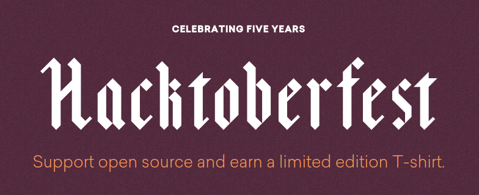

# Hacktoberfest

## Valores do evento:

- Todos são bem-vindos
- Quantidade é divertido, qualidade é chave
- Ações de curto prazo, impacto de longo prazo

## Regras:

- Enviar 5 PR's para qualquer repositório público até dia 31 de Outubro
- Os PR's não precisam ser aceitos/mergeados para contar
- Muitas issues boas para iniciantes vão estar

## Links Úteis

Cadastro no programa

    https://hacktoberfest.digitalocean.com/sign_up/register

Medidor de Progresso

    https://hacktoberfest.digitalocean.com/

How to create a Pull Request

    https://www.digitalocean.com/community/tutorials/how-to-create-a-pull-request-on-github

Hacktoberfest@Microsoft

    https://github.com/Microsoft/Hacktoberfest

Introduction to Open-Source: 

    https://www.digitalocean.com/community/tutorial_series/an-introduction-to-open-source
    https://opensource.guide/how-to-contribute/
    https://www.twilio.com/quest/mission/28

Sites com curadoria de issues para iniciantes:

    https://up-for-grabs.net/#/
    http://issuehub.io/
    https://www.firsttimersonly.com/
    http://yourfirstpr.github.io/
    https://github.com/mungell/awesome-for-beginners

Mais avançados:
  
    http://www.pullrequestroulette.com/
    https://www.codetriage.com/
    https://24pullrequests.com/

Repositórios com tag #hacktoberfest: 

    https://github.com/search?utf8=%E2%9C%93&q=state%3Aopen+label%3Ahacktoberfest&type=Issues&ref=searchresults